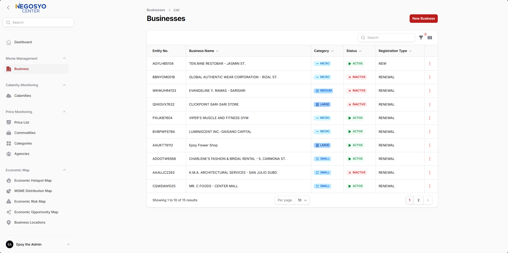
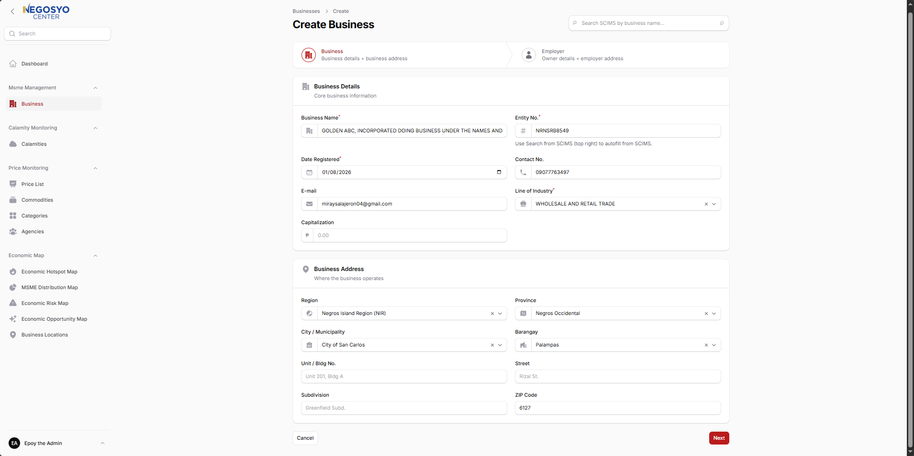
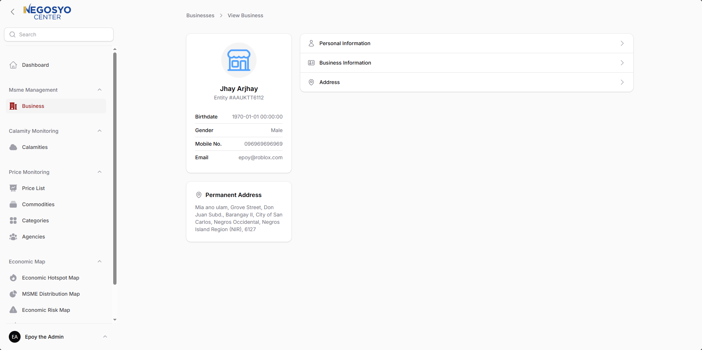
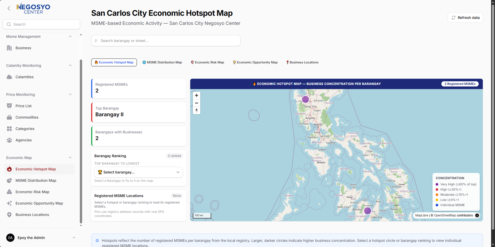
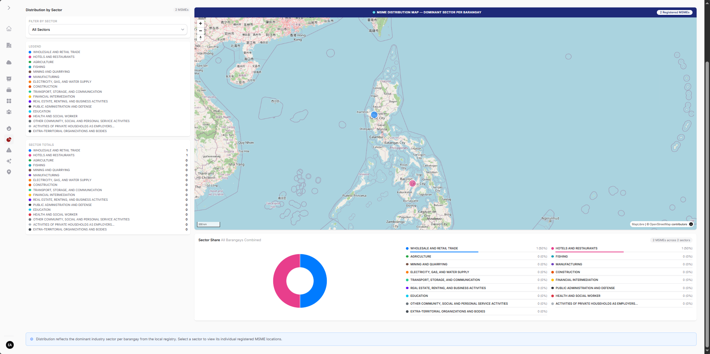
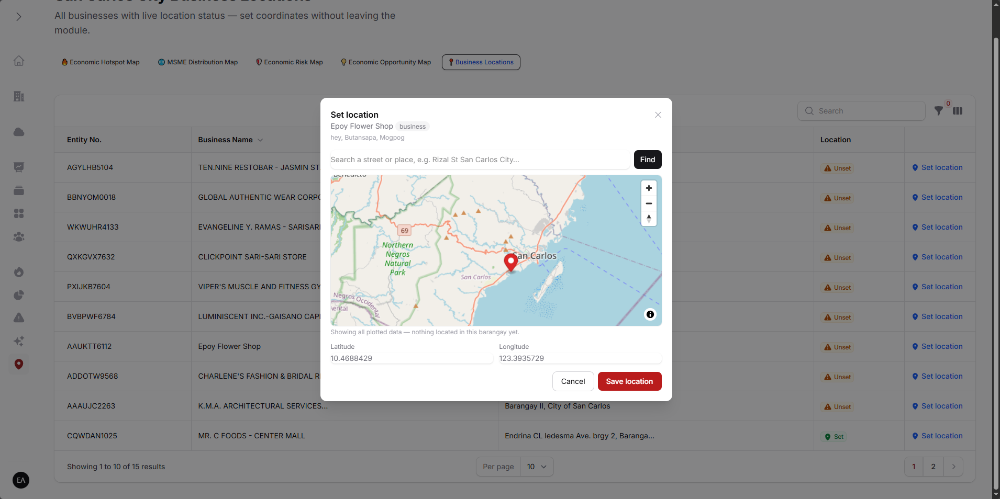
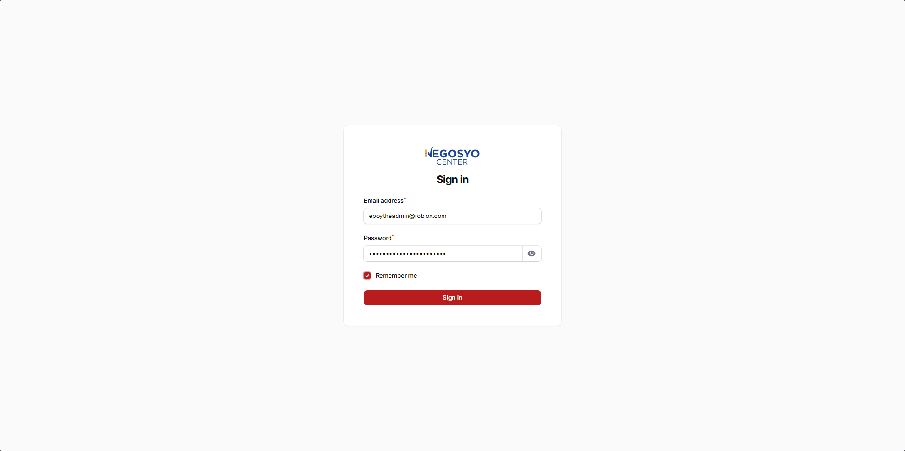

<p align="center">
  
</p>

<p align="center"><strong>MSME registry and economic mapping for the San Carlos City Negosyo Center</strong></p>

<p align="center">
  
  
  
  
  
  
</p>

## About

NegosyoTrack is a web-based management system built for the San Carlos City Negosyo Center, digitizing how the local government unit tracks, supports, and plans around its micro, small, and medium enterprises (MSMEs). It runs on Laravel with a Filament administration panel, backed by MySQL and a versioned JSON API that every module reads and writes through — one source of truth across the whole system.

At its core is the MSME registry: juridical businesses, their employers, and their addresses. Business creation runs through a guided two-step wizard with cascading region–province–city–barangay selects and live SCIMS search that autocompletes records from the external registry, while updates flow through dedicated API endpoints for business details, employer data, addresses, status changes, and renewals.

Built on top of the registry is the Economic Map module — interactive MapLibre-powered maps turning records into decision support: hotspot, distribution, risk, and opportunity views, plus a workbench for geocoding unmapped records. Calamity monitoring (events, incidents, damage costs) feeds the risk model, and price monitoring (agencies, commodities, prevailing vs. SRP prices) covers market oversight. One workspace for registration, disaster response, market monitoring, and economic planning.

## Features

### MSME Registry

Businesses, employers, and addresses with full list, view, create, and edit flows — search, filters, category badges, and status management included.



### Guided Creation Wizard

Two-step business + employer capture with SCIMS registry search that autocompletes the form, cascading Philippine address dropdowns, and inline validation.



### Business Profiles

Full record view across personal, business, and address sections — contact and financial editing, status changes, and renewals, all synced through the API.



### Economic Hotspot Map

Business concentration per barangay with ranked lists, per-barangay drill-down pins, and area search with summaries.



### Industry Distribution Map

Seventeen-sector breakdown with a filterable sector list, legend, totals, and a combined sector-share view.



### Location Workbench

Every address missing coordinates, in one table — drop a pin on the mini-map or type coordinates to locate records, with changes reflected on the maps immediately.



### Sign-in



## Tech Stack

| Layer | Technology |
|---|---|
| Language | PHP 8.4 |
| Framework | Laravel 13 |
| Admin panel | Filament 5 (Livewire 4) |
| Database | MySQL |
| Maps | MapLibre GL 6 (vendored, OSM raster tiles) |
| Charts | Chart.js 4 |
| Styling | Tailwind CSS 4 |
| Build | Vite |

## API Overview

All modules consume these JSON endpoints (`routes/api.php`):

| Method | Endpoint | Purpose |
|---|---|---|
| `GET` | `/api/msme` | Business list (supports `?search=`) |
| `POST` | `/api/msme` | Create business + employer + addresses |
| `PUT` | `/api/msme/employer/{entity_no}` | Update employer |
| `PUT` | `/api/msme/juridical/{entity_no}` | Update business |
| `PUT` | `/api/msme/address/{address}` | Update address |
| `PATCH` | `/api/msme/status/{juridical}` | Change business status |
| `PATCH` | `/api/msme/renew/{juridical}` | Renew business |
| `PATCH` | `/api/msme/location/{address}` | Save coordinates |

## Getting Started

```bash
# 1. Install dependencies
composer install
npm install

# 2. Configure environment
cp .env.example .env
php artisan key:generate
# → set DB_CONNECTION, DB_HOST, DB_PORT, DB_DATABASE, DB_USERNAME, DB_PASSWORD

# 3. Build frontend assets
npm run build

# 4. Migrate (full schema ships in database/migrations)
php artisan migrate

# 5. Serve (or use Laravel Herd: https://herd.laravel.com)
php artisan serve
```

Then sign in at the app URL with an existing user account.

## Project Structure

```text
app/
├── Filament/
│   ├── Pages/EconomicMap/        # Hotspot, Distribution, Risk, Opportunity, Business Locations
│   └── Resources/
│       ├── MsmeManagement/Juridicals/   # Business resource, wizard, tables, schemas
│       ├── CalamityMonitoring/          # Calamity resources
│       └── PriceMonitoring/             # Price monitoring resources
├── Http/Controllers/Api/
│   └── MsmeController.php        # msme.* JSON endpoints
├── Models/
│   ├── MsmeManagement/           # Juridical, Employer, Address
│   └── PriceMonitoring/          # Agency, ...
└── Services/
    ├── ScimsApiService.php       # SCIMS registry client
    ├── AddressApiService.php     # Philippine address reference data
    ├── AddressManager.php        # Cascading dropdown orchestration
    ├── EconomicMapService.php    # Map aggregates (hotspot, distribution, search)
    ├── EconomicMap/CalamityFeed.php  # Damage history feed
    └── Industries.php            # Canonical 17-sector list
config/
└── economic-map.php              # Map bands, sector colors, cache TTL
routes/
└── api.php                       # API endpoint definitions
```

## Roadmap

- [ ] Risk + Opportunity tabs live (hazard ratings, tourism/agriculture/population sources)
- [ ] Price-pressure map layer once price monitoring matures
- [ ] Barangay boundary overlays from LGU GIS shapefiles
- [ ] Calamity + price module get-APIs feeding the map service directly

## License

Proprietary — internal use of the San Carlos City Government. All rights reserved. Unauthorized copying, distribution, or use outside the Negosyo Center is prohibited.
